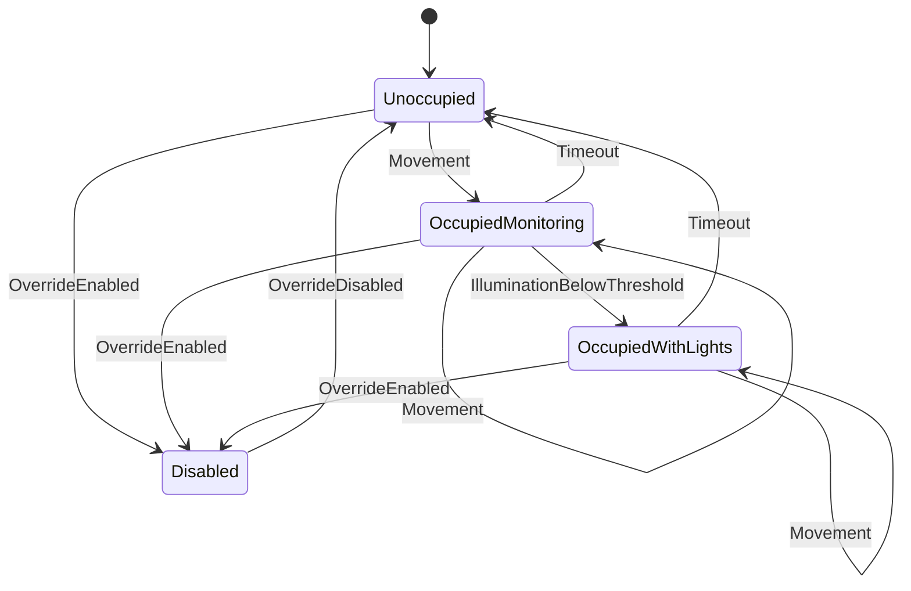

# State Diagram

```mermaid
stateDiagram-v2
  state Unoccupied
  state OccupiedMonitoring
  state OccupiedWithLights
  state Disabled

  [*] --> Unoccupied
  Unoccupied --> OccupiedMonitoring: Movement
  OccupiedMonitoring --> OccupiedWithLights: IlluminationBelowThreshold
  OccupiedMonitoring --> OccupiedMonitoring: Movement
  OccupiedMonitoring --> Unoccupied: Timeout
  OccupiedWithLights --> OccupiedWithLights: Movement
  OccupiedWithLights --> Unoccupied: Timeout

  Unoccupied --> Disabled: OverrideEnabled
  OccupiedMonitoring --> Disabled: OverrideEnabled
  OccupiedWithLights --> Disabled: OverrideEnabled

  Disabled --> Unoccupied: OverrideDisabled
```
